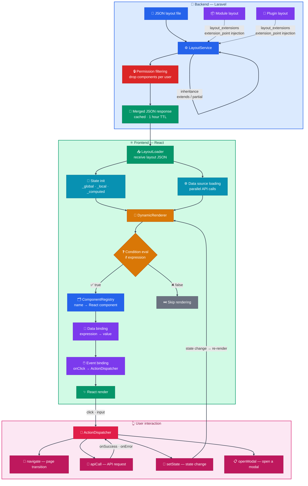

<p align="center">English | <a href="README.ko.md">한국어</a></p>

<p align="center">
  
</p>

<p align="center">
  <strong>A modern, extensible CMS platform built with Laravel + React</strong><br>
  The next generation of Gnuboard — Korea's most widely used open-source CMS
</p>

<p align="center">
  <a href="#"></a>
  <a href="#"></a>
  <a href="#"></a>
  <a href="#"></a>
  <a href="LICENSE"></a>
  <a href="#"></a>
</p>

<p align="center">
  <a href="https://g7.gnuboard.com"><strong>Live Demo</strong></a> ·
  <a href="https://g7.gnuboard.com/admin"><strong>Admin Demo</strong></a>
</p>

<p align="center">
  <sub>The demo UI language follows your browser (Korean/English); you can switch it in the UI.</sub>
</p>

---

[About](#about-gnuboard7) · [Key Features](#key-features) · [Tech Stack](#tech-stack) · [Architecture](#architecture) · [Quick Start](#quick-start) · [Bundled Extensions](#bundled-extensions) · [Business Models](#business-models) · [Migrating from Gnuboard 5](#migrating-from-gnuboard-5) · [Documentation](#documentation) · [Contributing](#contributing) · [Team](#team) · [Community](#community) · [Changelog](#changelog) · [License](#license)

---

## About Gnuboard7

**Gnuboard7** is a complete, ground-up redesign of Gnuboard — Korea's most widely used open-source CMS for 23 years — rebuilt on a modern stack.

Everything from security to architecture was rewritten from scratch on Laravel and React.

- **JSON layout engine**: define React-based UI declaratively with JSON alone, no React knowledge required. Modules and plugins inject or extend UI dynamically through JSON without a frontend build. When you need something more advanced, you can develop and register custom React components
- **One platform, many business models**: community, storefront, subscription, booking — extend it to fit your business
- **Fine-grained access control**: Role + Permission + Scope, a three-tier model that keeps control as your service grows
- **Global-ready**: native i18n support, locale-driven UI, multi-currency handling
- **Extension system**: modules + plugins + templates, a three-layer structure that adds functionality without touching the core

---

## Key Features

Everything a modern web platform needs, built in.

| Area | Description |
|------|-------------|
| **Modular architecture** | Modules + plugins + templates, a three-layer extension structure. Independent modules (boards, commerce, and more) can be developed without modifying the core. Hook-based injection preserves the clear layering of the Service-Repository pattern |
| **Language pack system** | Install a new language from a ZIP file or GitHub URL without touching the core. Official bundled language packs (Japanese and others) are ready to use immediately, and labels an operator has edited are preserved per sub-key so a language pack never overwrites them. Packs apply independently to modules, plugins, and templates |
| **Localization** | A consistent multilingual development experience from backend to frontend. Active language packs automatically enrich notification channel labels, provider/registry payloads, and settings catalogs (payment methods, currencies, shippable countries). Activity log and message surfaces are separated so modules and plugins describe their own domain labels in their own territory |
| **Payment gateways** | A foundation for growing beyond a local business into global commerce. Payment integrations attach through the same extension-point pattern, and international gateways ship as separate plugins |
| **Access control** | Control menus, features, and even data scope per role. Role + Permission + Scope three-tier access control provides flexible management that mirrors your organization |
| **Identity verification (IDV)** | Every verification point — signup, password reset, sensitive operations — is managed centrally through declarative route/hook-level policies. The core ships a mail provider built in, and external providers (Korean identity-verification services such as KG Inicis and NHN KCP, as well as SMS, PortOne, and Stripe Identity-style services) attach through the same provider contract. When the server returns HTTP 428, the frontend interceptor opens a verification modal automatically and replays the original request on success |
| **Security** | Automatic input validation and token-based authentication. Layered defense designed in from the start (CSRF/XSS/SQL injection), a real implementation of login throttling and account lockout (HTTP 423), and automatic blocking of installer endpoints once setup completes (HTTP 410) |
| **Flexible screen composition** | Define a screen structure and see it applied immediately. Web-app-grade dynamic screens are achievable with JSON declarations alone, no frontend infrastructure required |
| **Layout editor** | A WYSIWYG layout editor lets you place screen blocks directly and see the result right away |
| **Proven foundation** | Built on Laravel + React — a stack adopted by companies worldwide, offering high extensibility and flexible UI implementation |
| **Shared cache system** | `CacheInterface` plus three drivers (core/module/plugin) isolate key prefixes automatically (`g7:core:`, `g7:module.{id}:`, `g7:plugin.{id}:`). Tag-based automatic invalidation and central TTL management via `g7_core_settings('cache.*_ttl')` keep operations free of hardcoded values |
| **Notification system** | A three-tier model — Definition × Template × Recipients — supports independent multi-channel delivery over mail, database, and real-time broadcast (Reverb). Targeting by author, role, specific users, or permission holders, plus hook-based dispatch, lets modules register their own notifications freely |
| **SEO** | Powered by `jaybizzle/crawler-detect`, roughly 1,000 bot types (search engines, social unfurlers, AI search) are detected automatically: bots receive static HTML while regular users get the SPA. OG/Twitter card metadata, domain schemas declared by modules (Article/Product/Offer/AggregateRating), automatic and manual sitemap generation, and generator meta tags are all provided by the core |
| **Activity log** | Administrator and user activity is recorded and searchable automatically. The Monolog-based structure is easy to extend, and action labels resolve from a module's or plugin's own translation files first, so each domain describes itself |
| **Search** | Full-text search powered by Laravel Scout, covering key content such as products and posts |

---

## Tech Stack

| Layer | Technology |
|-------|------------|
| **Backend** | PHP 8.2+, Laravel 12.x, MySQL 8.0+ / MariaDB 10.3+, Redis 6.0+ |
| **Frontend** | React 19, Vite, Tailwind CSS 4 (dark mode supported) |
| **Authentication** | Laravel Sanctum (Bearer tokens) |
| **Testing** | PHPUnit 11.x, Vitest |
| **Code quality** | Laravel Pint (PSR-12) |

---

## Architecture

```
Gnuboard7
├── Core (Laravel 12)
│   ├── Controller → FormRequest → Service → Repository → Model
│   ├── Hook System (Action / Filter)
│   ├── Permission (Role → Permission → Scope)
│   ├── Identity Verification (Policy × Purpose × Provider × Message)
│   ├── Language Pack (virtual protected rows + ZIP/GitHub install + sub-key preservation)
│   ├── Notification (Definition × Template × Recipients)
│   └── SEO (Bot Detection → Static HTML → Cache → Sitemap)
│
├── Extensions
│   ├── Modules    — board, commerce, page ...
│   ├── Plugins    — payment, verification, marketing ...
│   ├── Templates  — admin UI, user UI
│   └── LanguagePacks — official and third-party packs (Japanese and more)
│
└── Template Engine
    ├── JSON Layout → React Components
    └── Dynamic Rendering + Data Binding
```

### How the template engine works

In Gnuboard7 you **declare the UI structure in JSON**, and the engine interprets it and renders React components.

#### What it gives you

- Build React-based UI from JSON declarations alone — screen development without React expertise
- Modules and plugins inject or extend UI dynamically through JSON, with no frontend build
- Develop and register custom React components when a screen needs something more advanced
- Because the UI is defined as data (JSON) rather than code, a **WYSIWYG layout editor** lets non-developers place and edit screen blocks and see the result immediately



**JSON layout example** — the JSON below renders as a real React UI:

```json
{
  "data_sources": [
    { "id": "products", "endpoint": "/api/products", "method": "GET" }
  ],
  "layout": {
    "type": "basic", "name": "Div",
    "children": [
      { "type": "basic", "name": "H1", "text": "$t:product_list" },
      {
        "type": "basic", "name": "Div",
        "iteration": { "source": "{{products?.data?.data}}", "item_var": "$item" },
        "children": [
          { "type": "basic", "name": "Span", "text": "{{$item.name}}" }
        ]
      },
      {
        "type": "basic", "name": "Button", "text": "$t:add",
        "if": "{{products?.data?.abilities?.can_create}}",
        "actions": [{
          "event": "onClick",
          "handler": "navigate",
          "params": { "path": "/products/create" }
        }]
      }
    ]
  }
}
```

Activating a module or plugin injects its UI and components automatically.
Developers add or change UI with JSON alone — no separate frontend build — and UI elements are shown or hidden automatically according to permissions (abilities).

### Core systems

Four systems work together to hold the platform up.

#### 1. Extension system — three principles

1. **Minimal core modification** — all business logic lives in modules and plugins
2. **Dynamic loading** — discovered automatically by directory scan, with no `composer.json` hardcoding
3. **Hook-based extension** — functionality is injected at the service layer through action and filter hooks

#### 2. Hook system (Action / Filter)

A lightweight hook system that operates separately from Laravel events. Actions handle side effects (logging, notifications); filters transform values (injecting defaults, extending permissions).

```php
// Publish hooks from the service layer
HookManager::doAction('core.user.after_create', $user, $data);
$data = HookManager::applyFilters('core.user.filter_create_data', $data);

// A module listener subscribes to the hook (auto-discovered)
public static function getSubscribedHooks(): array
{
    return [
        'core.user.after_create' => ['method' => 'onUserCreated', 'priority' => 20],
    ];
}
```

Modules and plugins only need to place a class in their `Listeners/` directory and `HookListenerRegistrar` subscribes it automatically. Asynchronous execution through queue serialization is supported as well, and context such as `Auth::user()`, `request()->ip()`, and `App::getLocale()` is restored automatically inside the worker.

#### 3. Shared cache system

Built on `CacheInterface`, the **core, modules, and plugins** each manage their own cache without key collisions.

| Driver | Prefix | Purpose |
| --- | --- | --- |
| `CoreCacheDriver` | `g7:core:{key}` | Core services (layouts, SEO, notifications, settings) |
| `ModuleCacheDriver` | `g7:module.{identifier}:{key}` | Per-module isolated cache (board and product lists, cooldowns) |
| `PluginCacheDriver` | `g7:plugin.{identifier}:{key}` | Per-plugin isolated cache |

```php
// Register a module service in the BaseModuleServiceProvider::$cacheServices array
// and it is injected from the constructor type hint alone (same as the storage pattern)
public function __construct(
    private BoardRepositoryInterface $repository,
    private CacheInterface $cache, // ← g7:module.sirsoft-board: prefix applied automatically
) {}
```

- **Central TTL management** — every cache TTL follows `g7_core_settings('cache.*_ttl')`. No hardcoding
- **Automatic invalidation** — apply the `CacheInvalidatable` trait to a model and related caches are dropped by tag on `saved` / `deleted`
- **Lifecycle integration** — when a module is deactivated or removed, `ModuleManager` flushes that module's isolated cache in bulk
- **Frontend cache busting** — incrementing `ext.cache_version` propagates through the response `config.json` and invalidates browser caches via a `?v=` query parameter

#### 4. Notification system

Multi-channel notifications are managed through a three-tier model: **Definition × Template × Recipients**.

```text
┌─────────────────────┐      ┌───────────────────────┐      ┌─────────────────────┐
│ NotificationDefini- │ 1..N │ NotificationTemplate  │      │ Recipients (JSON)   │
│ tion                ├──────┤ (independent per      ├──────┤ - trigger_user      │
│ type=order.created  │      │  channel)             │      │ - related_user      │
│ variables=[...]     │      │ channel=mail|db|...   │      │ - role              │
│                     │      │ subject, body,        │      │ - specific_users    │
│                     │      │ click_url             │      │                     │
└─────────────────────┘      └───────────────────────┘      └─────────────────────┘
```

- **Definition** — declares the notification type, supported channels, and variable metadata
- **Template** — an independent subject, body, and click URL per channel (`mail` / `database` / `broadcast`). Administrators can customize them in multiple languages
- **Recipients** — recipient rules declared as JSON per template. Because they are per-template, you can branch freely: "mail to the buyer, database notification to role holders"

```php
// A module service only publishes a hook; the delivery pipeline runs automatically
HookManager::doAction('sirsoft-ecommerce.order.after_confirm', $order);

// ↓ NotificationHookListener → NotificationDispatcher:
// 1. Look up the order.confirmed definition
// 2. Iterate active templates (mail/database)
// 3. Resolve each template's recipients JSON → recipient collection
// 4. Deliver per channel to each recipient (GenericNotification)
// 5. Record the delivery in notification_logs
```

- Three core notifications: `welcome`, `reset_password`, `password_changed`
- Seven e-commerce module notifications: `order_confirmed`, `order_shipped`, `order_completed`, `order_cancelled`, `new_order_admin`, `inquiry_received`, `inquiry_replied`
- Real-time broadcasting runs on Laravel Reverb (WebSocket). Where Reverb is not configured, it skips gracefully without errors
- A single `GenericNotification` class handles every notification — adding a new notification type requires no new notification class

#### 5. Language pack system

An operations tool for adding a new language without touching the core, with the same lifecycle as module, plugin, and template management (install → activate → update → remove, with automatic backup and rollback).

| Area | Behavior |
| --- | --- |
| Install paths | ZIP upload / GitHub URL / the `lang-packs/_bundled` bundled directory (synchronized in bulk on core updates) |
| Scope | Applied separately to the core, modules, plugins, and templates — a module pack activates only while the matching core pack is active |
| Preserving operator edits | Multilingual JSON columns record user overrides per sub-key (`name.ko` / `name.ja`), so editing one language's label preserves only that language while new languages sync automatically |
| Activation effects | On activation or deactivation, the entity seeders of affected modules and plugins re-run, so menus, permissions, roles, manifests, and notification labels reach the database immediately |
| Virtual protected rows | Korean and English are built into the core and bundled extensions and are always exposed as active and protected (editing and removal are blocked) |
| Security | Installation is blocked if a pack contains executable PHP beyond language translations |

Sixteen official Japanese (ja) bundled packs — the core plus the main modules, plugins, and templates — are ready to use, and step 4 of the installer links language pack cards to your module, plugin, and template selection so they can be installed together.

> Details: [docs/extension/language-packs.md](docs/extension/language-packs.md) (Korean)

#### 6. Identity verification

Every verification point — signup, password reset, sensitive operations, the moment before payment — is managed centrally through declarative route/hook-level policies.

```text
┌────────────────────┐    ┌─────────────────────┐    ┌──────────────────────┐
│ Policy             │    │ Purpose             │    │ Provider             │
│ (enforcement point │    │ (verification goal, │    │ (mail, KCP, Inicis,  │
│  failure mode,     │ ◀▶ │  allowed channels,  │ ◀▶ │  SMS, external IDV)  │
│  step, conditions) │    │  source tracking)   │    │                      │
└────────────────────┘    └─────────────────────┘    └──────────────────────┘
            │                                                  │
            └──────────▶ Message Template (policy × purpose) ◀──┘
                                    │
                              GenericNotification
```

- **Policy as the single source of truth** — toggling a policy takes effect immediately without editing route code. Every API route matches against the policy database automatically
- **428 interceptor** — when the server returns HTTP 428, the frontend opens a verification modal automatically and replays the original request once verification succeeds
- **Declarative registration** — modules and plugins declare `module.php::getIdentityPolicies()` / `getIdentityPurposes()` / `getIdentityMessages()`, and those are registered automatically on activation or update while preserving operator edits
- **Message templates** — define multilingual subjects and bodies per provider and per purpose/policy, falling back in the order policy → purpose → provider default
- **External provider slots** — plugins can inject their own SDK UI for services such as KCP, PortOne, Toss verification, or Stripe Identity through the standard G7 extension-point pattern
- **History management** — the admin screen offers tabs per verification method, unified search, multi-filters for status/purpose/channel/IP, and bulk destruction by retention period (180 days)

> Details: [docs/backend/identity-policies.md](docs/backend/identity-policies.md), [docs/backend/identity-providers.md](docs/backend/identity-providers.md), [docs/backend/identity-messages.md](docs/backend/identity-messages.md) (Korean)

---

## Quick Start

### System requirements

- PHP 8.2+ with the required extensions (16 in total), including `ctype`, `curl`, `dom`, `fileinfo`, `json`, `mbstring`, `openssl`, `pdo_mysql`, `tokenizer`, `xml`, and `zip`. Additional extensions (`gd`/`imagick`, `intl`, `redis`, `bcmath`, and others) are optional and only needed for the features that use them — see [docs/requirements.md](docs/requirements.md)
- MySQL 8.0+ or MariaDB 10.3+ (utf8mb4)
- Composer 2.x
- Node.js 20+ (only needed when building frontend assets)
- A web server (Apache or Nginx) with the document root pointed at `public/`
- Redis 6.0+ (optional — recommended for cache and queue in production)

### Installation

```bash
# 1. Clone the project
git clone https://github.com/gnuboard/g7.git
cd g7

# 2. Install PHP dependencies
composer install

# 3. Copy the environment file
cp .env.example .env

# 4. Point your web server's document root at the public/ directory,
#    then open /install in a browser and follow the setup wizard
```

The setup wizard creates the application key, configures the database connection, runs the migrations, and lets you choose which modules, plugins, templates, and language packs to install. Once setup completes, the installer endpoints are blocked automatically (HTTP 410).

> Detailed installation guide (Korean): [INSTALL.md](INSTALL.md)

---

## Bundled Extensions

### Modules

| Module | Description |
|--------|-------------|
| **sirsoft-board** | Boards — multiple boards, comments, file attachments |
| **sirsoft-ecommerce** | Storefront — products, orders, payments, shipping, coupons, product inquiries |
| **sirsoft-page** | Pages — static content management |

### Plugins

| Plugin | Description |
|--------|-------------|
| **sirsoft-pay_kginicis** | KG Inicis payment integration (Korean payment gateway) |
| **sirsoft-pay_nicepayments** | NICE Payments integration (Korean payment gateway, unified checkout) |
| **sirsoft-pay_nhnkcp** | NHN KCP payment integration (Korean payment gateway, Standard Pay) |
| **sirsoft-tosspayments** | Toss Payments integration (Korean payment gateway) |
| **sirsoft-verification_kginicis** | KG Inicis identity verification (Korean identity verification) |
| **sirsoft-verification_nhnkcp** | NHN KCP mobile identity verification (Korean identity verification) |
| **sirsoft-daum_postcode** | Daum postcode lookup (Korean address search) |
| **sirsoft-marketing** | Marketing tools |
| **sirsoft-ckeditor5** | CKEditor 5 editor |
| **sirsoft-gdpr** | Privacy and GDPR support |
| **sirsoft-message_bizppurio** | Bizppurio messaging (SMS/LMS and KakaoTalk alimtalk delivery) |

### Templates

| Template | Description |
|----------|-------------|
| **sirsoft-admin_basic** | Default admin template |
| **sirsoft-basic** | Default user template |

### Bundled language packs

Official language packs you can install alongside the initial setup, so the core and the main modules, plugins, and templates share one consistent translation from the start.

| Identifier | Description |
| ---------- | ----------- |
| **g7-core-ja** | Core, Japanese |
| **g7-core-zh-CN** | Core, Simplified Chinese |
| **g7-module-sirsoft-board-ja** | Board module, Japanese |
| **g7-module-sirsoft-board-zh-CN** | Board module, Simplified Chinese |
| **g7-module-sirsoft-ecommerce-ja** | E-commerce module, Japanese |
| **g7-module-sirsoft-page-ja** | Page module, Japanese |
| **g7-plugin-sirsoft-ckeditor5-ja** | CKEditor 5 plugin, Japanese |
| **g7-plugin-sirsoft-daum_postcode-ja** | Daum postcode plugin, Japanese |
| **g7-plugin-sirsoft-gdpr-ja** | Privacy/GDPR plugin, Japanese |
| **g7-plugin-sirsoft-marketing-ja** | Marketing plugin, Japanese |
| **g7-plugin-sirsoft-message_bizppurio-ja** | Bizppurio messaging plugin, Japanese |
| **g7-plugin-sirsoft-pay_kginicis-ja** | KG Inicis payment plugin, Japanese |
| **g7-plugin-sirsoft-pay_nicepayments-ja** | NICE Payments plugin, Japanese |
| **g7-plugin-sirsoft-pay_nhnkcp-ja** | NHN KCP payment plugin, Japanese |
| **g7-plugin-sirsoft-tosspayments-ja** | Toss Payments plugin, Japanese |
| **g7-plugin-sirsoft-verification_kginicis-ja** | KG Inicis identity verification plugin, Japanese |
| **g7-plugin-sirsoft-verification_nhnkcp-ja** | NHN KCP mobile identity verification plugin, Japanese |
| **g7-template-sirsoft-admin_basic-ja** | Default admin template, Japanese |
| **g7-template-sirsoft-basic-ja** | Default user template, Japanese |

> Korean and English are built into the core and bundled extensions and are always active without installation. Any other language can be added freely from a ZIP file or a GitHub URL.

### Sample extensions for learning

Minimal implementations for learning the extension system. They appear in the admin UI when the "include hidden" toggle is on, and are always visible from the CLI.

| Identifier | Type | Description |
| ---------- | ---- | ----------- |
| **gnuboard7-hello_module** | Module | Memo CRUD plus a hook publishing demo |
| **gnuboard7-hello_plugin** | Plugin | Action/filter hook subscription demo |
| **gnuboard7-hello_admin_template** | Admin template | A minimal set of basic components |
| **gnuboard7-hello_user_template** | User template | Home page plus a memo list integration |

---

## Business Models

One Gnuboard7 installation can run a range of businesses.

| Model | Description | Status |
|-------|-------------|--------|
| **Community** | Boards, comments, member management | Stable |
| **Commerce** | Product registration, orders, payments, shipping management | Stable |

---

## Migrating from Gnuboard 5

A migration tool from Gnuboard 5 is planned.

---

## Documentation

> Documentation is currently available in Korean only. English documentation is planned.

| Document | Link |
|----------|------|
| Installation guide | [INSTALL.md](INSTALL.md) |
| Full documentation | [docs/README.md](docs/README.md) |
| System requirements | [docs/requirements.md](docs/requirements.md) |
| Backend development | [docs/backend/README.md](docs/backend/README.md) |
| Frontend development | [docs/frontend/README.md](docs/frontend/README.md) |
| Database | [docs/database-guide.md](docs/database-guide.md) |
| Extension system | [docs/extension/README.md](docs/extension/README.md) |
| Module development | [docs/extension/module-basics.md](docs/extension/module-basics.md) |
| Plugin development | [docs/extension/plugin-development.md](docs/extension/plugin-development.md) |
| Template development | [docs/extension/template-basics.md](docs/extension/template-basics.md) |
| Testing | [docs/testing-guide.md](docs/testing-guide.md) |
| API reference | [docs/backend/api/README.md](docs/backend/api/README.md) |
| API documentation policy | [docs/backend/api-documentation.md](docs/backend/api-documentation.md) |

---

## Contributing

Gnuboard7 is an open-source project, and contributions of every kind are welcome.

- Bug reports and feature proposals: [GitHub Issues](https://github.com/gnuboard/g7/issues)
- Code style: Laravel Pint (PSR-12)
- Testing: PHPUnit (backend) + Vitest (frontend)
- AI collaboration: the repository ships a development rule specification for AI agents (AGENTS.md) along with MCP debugging tools, so AI tooling fits naturally into the workflow

---

## Team

Developed by **[SIRSOFT](https://sir.kr)**.

### Core Team

<p>
  <a href="https://github.com/HeuJung"></a>&nbsp;&nbsp;
  <a href="https://github.com/chym1217"></a>&nbsp;&nbsp;
  <a href="https://github.com/thisgun"></a>
</p>

### Community Contributors

Thanks to everyone who reported an issue or suggested a feature that shipped — the list below is compiled from the attributions in our changelogs.

<!-- community-contributors:start -->
<p>
  <a href="https://github.com/jiwonpapa" title="jiwonpapa"></a>
  <a href="https://github.com/Tuwasduliebst" title="Tuwasduliebst"></a>
  <a href="https://github.com/glitter-gim" title="glitter-gim"></a>
  <a href="https://github.com/jordy-bitree" title="jordy-bitree"></a>
  <a href="https://github.com/laelbe" title="laelbe"></a>
  <a href="https://github.com/lyg-kaban" title="lyg-kaban"></a>
  <a href="https://github.com/bigmsg" title="bigmsg"></a>
  <a href="https://github.com/abc101" title="abc101"></a>
  <a href="https://github.com/hwaryeon1234" title="hwaryeon1234"></a>
  <a href="https://github.com/koojunho" title="koojunho"></a>
  <a href="https://github.com/yks118" title="yks118"></a>
  <a href="https://github.com/kitrio" title="kitrio"></a>
  <a href="https://github.com/movielee2020" title="movielee2020"></a>
  <a href="https://github.com/ChoDongHyeon" title="ChoDongHyeon"></a>
  <a href="https://github.com/comtylove-netizen" title="comtylove-netizen"></a>
  <a href="https://github.com/devrhee16" title="devrhee16"></a>
  <a href="https://github.com/GyusoonKim" title="GyusoonKim"></a>
  <a href="https://github.com/Lastorder-DC" title="Lastorder-DC"></a>
  <a href="https://github.com/miles44229" title="miles44229"></a>
  <a href="https://github.com/minyho" title="minyho"></a>
</p>
<!-- community-contributors:end -->

The list of code contributors is available on [GitHub Contributors](https://github.com/gnuboard/g7/graphs/contributors).

---

## Community

| Channel | Link |
|---------|------|
| GitHub | [github.com/gnuboard/g7](https://github.com/gnuboard/g7) |
| SIR community (Korean) | [sir.kr](https://sir.kr) |
| Contact | minsup@sir.kr |

---

## Changelog

For details on recent changes, see the [CHANGELOG](CHANGELOG.md) (Korean).

---

## Security Vulnerabilities

If you discover a security vulnerability, please report it as a private post on the [SIR inquiry board](https://sir.kr/boards/co_qa) (Korean board), or email minsup@sir.kr.

---

## License

Gnuboard7 is open-source software distributed under the [MIT License](LICENSE).

Copyright (c) 2026 SIRSOFT

---

<p align="center">
  Made by <a href="https://sir.kr">SIRSOFT</a>
</p>
